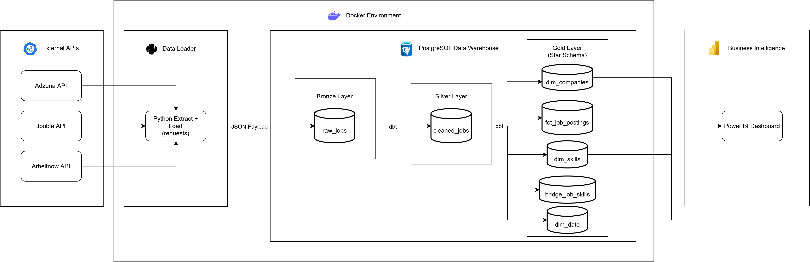

# Austrian Tech Job Market: End-to-End ELT Pipeline & Dashboard


*Dashboard updated via containerized pipeline.*

## 📊 Executive Summary
Built specifically to analyze the Austrian tech hiring market as a demonstration of production-grade data engineering applied to a real local business problem. 

This project is a fully containerized ELT pipeline that automatically extracts, transforms, and visualizes daily tech job postings across Austria, filtering out outlier data to provide realistic salary expectations and demand metrics.

**Key Insights (April 2026):**
* **In-Demand Skills:** AI (148 postings) and Java (94 postings) currently dominate the Austrian backend/data market.
* **Salary Expectations:** Backend roles command the highest median salaries (~€80K - €95K).
* **Remote Work:** Approximately 56% of tracked job postings offer remote flexibility.


## 🏗️ Data Architecture & Pipeline Flow



The pipeline follows a layered **Medallion Architecture:**

  *  **Bronze Layer:** Raw JSON API payloads stored in PostgreSQL.

  *  **Silver Layer:** Cleaned, standardized, and deduplicated job postings.

 *   **Gold Layer:** Analytics-ready Kimball Star Schema.

     *   **fct_job_postings** — Central fact table.

       * **dim_companies, dim_skills, dim_date** — Dimension tables.

      *  **bridge_job_skills** — Bridge table handling the many-to-many relationship between jobs and required skills.

## 🛠️ Tech Stack & Technical Choices

* **Data Extraction:** Python (Requests, Tenacity) — Chosen for lightweight, reliable API interaction and JSON parsing.

* **Data Warehouse:** PostgreSQL — Containerized for local reproducibility without cloud overhead.

* **Data Transformation:** dbt (Data Build Tool) — Chosen for SQL-native transformations, built-in data quality testing, and automatic lineage generation.

* **Orchestration:** Docker & Docker Compose — Ensures the entire infrastructure (DB + Pipeline) spins up with a single command.

* **Visualization:** Power BI — Connected directly to the Gold schema for interactive, executive-level reporting.

## 🧹 Data Quality Handling

Real-world API data is messy. This pipeline ensures statistical accuracy before the data ever reaches the dashboard:

* **Geographic Filtering:** APIs like Jooble frequently surface non-Austrian jobs incorrectly tagged as Austria. The pipeline implements a quality tier system (Tier 1/2/3) to flag and automatically exclude these false positives.
  
* **Austrian Salary Normalization:** Raw salaries are dynamically converted to yearly EUR explicitly using the **Austrian 14-month salary convention**. Extreme outliers (e.g., typos resulting in €300k+ or <€10k) are treated as parsing errors, and the BI layer enforces **Median** calculations rather than Averages to prevent skew.
  
* **HTML Artifact Removal:** Certain APIs return job descriptions polluted with HTML tags. The extraction layer utilizes multi-pass regex cleaning to strip tags and normalize text before database insertion.

* **Automated dbt Testing:** Enforced `unique` and `not_null` constraints on critical primary keys (like `job_id`), preventing duplicate or corrupt records from silently failing and making it into the Gold layer.

* **Statistical Significance Filtering:** The dashboard dynamically filters out "Highest Paying Skills" that have a sample size of fewer than 5 active job postings, preventing 1-off outliers from breaking the market analysis.

* **Cross-Source Deduplication:** Identical jobs appearing across Arbeitnow, Adzuna, and Jooble are deduplicated using composite keys to prevent double-counting.

* **UI Formatting:** Database strings (e.g., artificial_intelligence, ci_cd) are programmatically cleaned and capitalized for executive presentation.

## 🚀 How to Run Locally

1. Clone the repository:
```bash

git clone [https://github.com/ivan-stoliar/austria-dev-job-tracker.git]
cd austria-dev-job-tracker
```

2. Set up environment variables:
Copy the template file and add your credentials:
```bash

cp .env.example .env
```
3. Start the infrastructure:
Ensure Docker Desktop is running, then deploy the database and pipeline:
```bash

docker-compose up --build
```
4. What happens next?

    PostgreSQL becomes available on port 5432 (mapped to 5433 locally).

    Python extracts today's job data and loads the Bronze layer.

    dbt executes the Silver and Gold transformations.

    Connect Power BI to 127.0.0.1:5433 to view the live models.

## 📌 Future Improvements
* **Code Refactoring:** Refactor the `extract.py` script to strictly adhere to DRY (Don't Repeat Yourself) principles, improving modularity and testability.
* **Advanced NLP Integration:** Enhance the dbt Silver layer transformations with Natural Language Processing (NLP) to better extract implicit skills and context from unstructured job descriptions.
* **Cloud Migration (Microsoft Azure):** Evolve the local containerized stack into a fully managed enterprise cloud architecture utilizing:
  * **Azure Data Factory (ADF):** To orchestrate the extraction and ELT workflows.
  * **Azure Data Lake Storage Gen2 (ADLS):** As the scalable landing zone for raw JSON payloads.
  * **Azure SQL Database:** To host the transformed Silver and Gold analytical layers.
